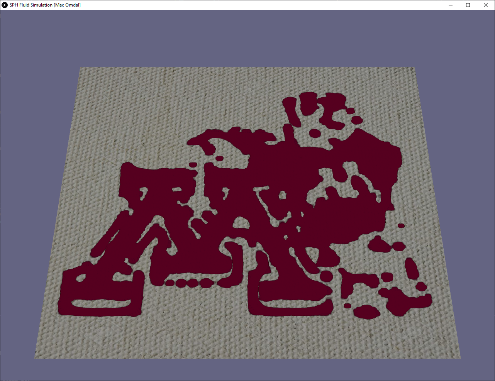

# SPH Fluid Simulation
This is a partial implementation of the paper "Particle-based Viscoelastic Fluid Simulation" by Clavet et al. You can read it [here](http://www.ligum.umontreal.ca/Clavet-2005-PVFS/pvfs.pdf).

# Painting
We use the fluid simulation to enable control of ink on canvas. The user can click and drag ink particles across the canvas. An initial image is thresholded and particles are placed at the brighter parts of the image.
